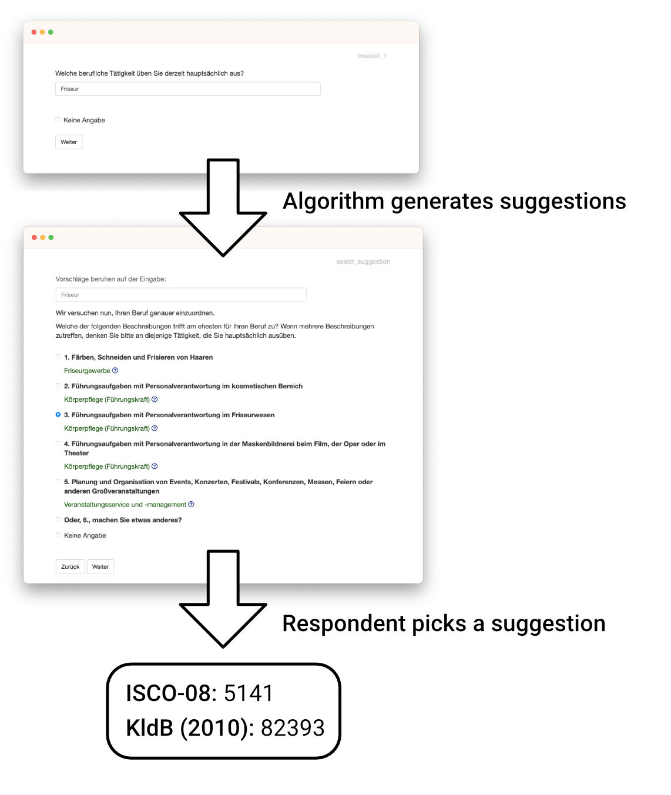

# occupationMeasurement 

<!-- badges: start -->
[](https://doi.org/10.21105/joss.05505)
[](https://github.com/occupationMeasurement/occupationMeasurement/actions/workflows/R-CMD-check.yaml)
[](https://CRAN.R-project.org/package=occupationMeasurement)
<!-- badges: end -->

A toolbox to help you with all tasks around the coding and measurement of occupations.

[[online demo](https://occupationmeasurement.shinyapps.io/app_demo/)[^1]]

[^1]: Demo for `questionnaire_demo()` running on shinyapps.io. Alternative demos for `questionnaire_web_survey()` [[demo](https://occupationmeasurement.shinyapps.io/app_web/)] and `questionnaire_interviewer_administered()` [[demo](https://occupationmeasurement.shinyapps.io/app_interviewer/)] are also available. Demos may be unavailable due to bandwidth restrictions.

## About

Coding people's occupations into official classifications such as the [International Standard Classification of Occupations ISCO-08](https://www.ilo.org/public/english/bureau/stat/isco/isco08/) or [German KldB-2010](https://statistik.arbeitsagentur.de/DE/Navigation/Grundlagen/Klassifikationen/Klassifikation-der-Berufe/Archiv-KldB/KldB2010/KldB2010-Nav.html) is a notoriously difficult problem. This toolbox is designed to make this easier, by helping with many of the tasks surrounding the measurement of occupations: From creating a survey and collecting data all the way to retrieving the final coded responses.

For a detailed overview of the package refer to `vignette("occupationMeasurement")` or take a look at `browseVignettes("occupationMeasurement")` to see a list of vignettes describing the package. All vignettes are also available in the [online documentation](https://occupationmeasurement.github.io/occupationMeasurement/index.html).



## Installation

Prerequisites:

- The [R Statistical Software](https://www.r-project.org/) (Version 4.1 or higher)

The package can be installed directly from CRAN by running the code below:

```r
install.packages("occupationMeasurement")
```

To install the latest development version from GitHub, run you will need the R package [remotes](https://remotes.r-lib.org/) available via `install.packages("remotes")`.

The package can then be installed by running the code below:

```r
remotes::install_github("occupationMeasurement/occupationMeasurement")
```

## Usage

### Using the interactive App

The interactive app is the easiest way to use the package: It provides a fully-featured, interactive survey application to collect and immediately code occupational data. Starting it is as easy as calling the `app()`-function.

More information about the interactive app can be found in `vignette("app")` and the help page `?app`.

```r
# Run the interactive shiny app
occupationMeasurement::app()
```

The app also supports custom questionnaires, so you can build your own or use and adapt one of the questionnaires included in the package. E.g., the `questionnaire_demo()` will explain the functionality of the app, and `questionnaire_interviewer_administered()` is designed to be read by interviewers in [CATI](https://en.wikipedia.org/wiki/Computer-assisted_telephone_interviewing) and [CAPI](https://en.wikipedia.org/wiki/Computer-assisted_personal_interviewing) surveys. The `questionnaire_web_survey()` is intended to be used for internet surveys.

```r
library(occupationMeasurement)

# Run the app with additional explanations. The best way to get started.
app(questionnaire = questionnaire_demo())

# Run the app in interviewer-administered ...
app(questionnaire = questionnaire_interviewer_administered())
# or online surveys
app(questionnaire = questionnaire_web_survey())
```

### Alternative Usage

Besides the interactive app, there are also two alternative ways of using this package, with varying degrees of flexibility and convenience:

1. Use the included JSON `api()` to use the package with your own survey-tool or application for maximum flexibility.
2. Use the R functions directly to implement your own custom functionality or package via e.g. `get_job_suggestions()`.

You can find more information on how to use these functionalities in `vignette("occupationMeasurement")`.

## Getting Help & Contributing

If you encounter any issues / bugs in the package, feel free to file an [issue on GitHub](https://github.com/occupationMeasurement/occupationMeasurement/issues), ideally alongside a clear reproducible example or description.

We also welcome contributions to the package. If you want to contribute to the development of the package, we recommend to first open an [issue](https://github.com/occupationMeasurement/occupationMeasurement/issues) to discuss your ideas and plans, before working on a pull request.

If you have any questions about the package or plan to use it in a project, feel free to reach out to one of the maintainers via email. The list of maintainers and their email addresses is in the `DESCRIPTION` file.

## Package Development

This section is only relevant when further developing the package itself. 

By default the package will only install dependencies it absolutely needs to run. For developing the package or running tests, the following packages can be installed via the snippet below.

```r
# Install development dependencies
install.packages(c(
  "devtools",
  "testthat",
  "shinytest2",
  "httr",
  "withr",
  "callr",
  "usethis",
  "mvtnorm",
  "readxl",
  "styler",
  "knitr",
  "rmarkdown",
  "DiagrammeR",
  "sessioninfo"
))
```

### Testing

The included tests can be run with the following snippet.

```r
devtools::test()
```

It is recommended to also run a more detailed check via the following snippet.

```r
devtools::check()
```

### Formatting

After making changes to the code, it is advised to automatically format all code with the {styler} package. This can be done with the following snippet.

```r
styler::style_pkg()
```

### Documentation

The documentation website is powered by {pkgdown}. It can be rebuilt with the following snippet. 

```r
pkgdown::build_site()
```

To set up everything for hosting the documentation on github pages use `usethis::use_pkgdown_github_pages()`.

During development, `roxygen2::roxygenise()` is useful to update .Rd-files.

## Acknowledgments

This project is funded by the Deutsche Forschungsgemeinschaft (DFG, German
Research Foundation) – Project numbers 290773872 and 460037581.
