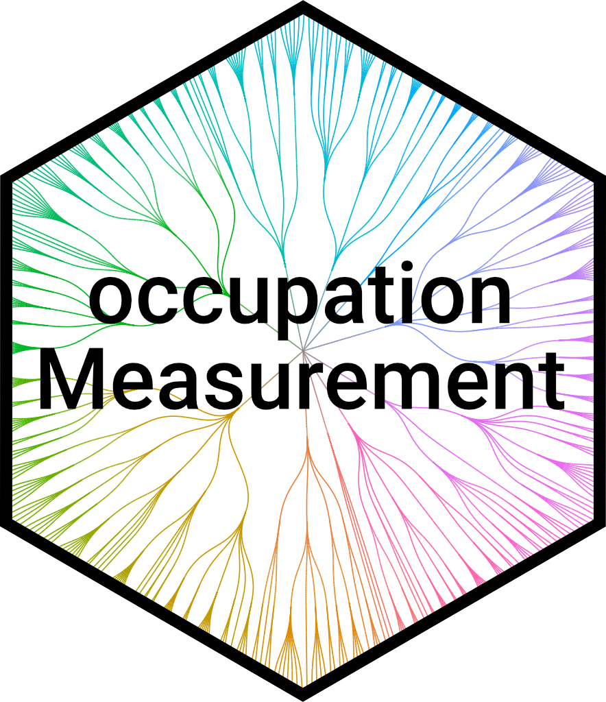

# occupationMeasurement 

<!-- badges: start -->
[](https://github.com/occupationMeasurement/occupationMeasurement/actions/workflows/R-CMD-check.yaml)
<!-- badges: end -->

A toolbox to help with all tasks around the interactive coding and measurement of occupations.

## Installation

Prerequisites:

- the [R Statistical Software](https://www.r-project.org/)
- `install.packages("remotes")`

```r
remotes::install_github("occupationMeasurement/occupationMeasurement")
```

For a detailed overview of the package refer to `vignette("occupationMeasurement")` or take a look at `browseVignettes("occupationMeasurement")` to see a list of vignettes describing the package.

## Using the interactive App

The interactive app can be started with the function `app()` function. 
More information about the interactive app can be found in `vignette("app")` and the help page `?app`.

```r
library(occupationMeasurement)

# Run the interactive shiny app
occupationMeasurement::app(questionnaire = questionnaire_web_survey())
```

The app also supports custom questionnaires, so you can build your own or use and adapt one of the questionnaires included in the package. E.g., the `questionnaire_demo` will explain the functionality of the app, and `questionnaire_interviewer_administered` is designed to be read by interviewers for CATI and CAPI surveys.

```r
library(occupationMeasurement)

# Run the app with additional explanations
app(questionnaire = questionnaire_demo())

# Run the app in interviewer-administered surveys
app(questionnaire = questionnaire_interviewer_administered())
```

## Alternative Usage

Besides the interactive app, there are also two alternative ways of using this package, with varying degrees of flexibility and convenience:

1. Use the included JSON `api()` to use the package with your own survey-tool or application for maximum flexibility.
2. Use the R functions directly to implement your own custom functionality or package via e.g. `get_job_suggestions()`.

You can find more information on how to use these functionalities in `vignette("occupationMeasurement")`.

## Package Development

### Testing

The included tests can be run with the following snippet.

```r
devtools::test()
```

It is recommended to also run a more detailed check via the following snippet.

```r
devtools::check()
```

### Formatting

After making changes to the code, it is advised to automatically format all code with the {styler} package. This can be done with the following snippet.

```r
styler::style_pkg()
```

### Documentation

The documentation website is powered by {pkgdown}. It can be rebuilt with the following snippet. 

```r
pkgdown::build_site()
```

To set up everything for hosting the documentation on github pages use `usethis::use_pkgdown_github_pages()`.

During development, `roxygen2::roxygenise()` is useful to update .Rd-files.

## Acknowledgments

This project is funded by the Deutsche Forschungsgemeinschaft (DFG, German
Research Foundation) – Project number 290773872.
