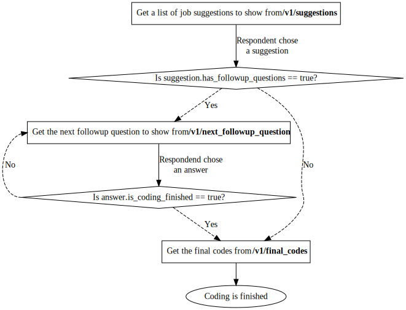

```{r, include = FALSE}
knitr::opts_chunk$set(
  collapse = TRUE,
  comment = "#>"
)
```

## Starting the API

Starting the API is simple, as you will only need to call the `api()` method. This will immediately start a local plumber server and will open a window with the API's documentation.

```{r eval=FALSE}
# Start the API (and open its documentation)
occupationMeasurement::api()
```

## Usage

The API is designed to allow for similar usage as the interactive application, but implementing the UI and its logic has to be done manually. It is recommended to use the same text prompts as the shiny application (`app()`) for consistency.

A typical workflow for using the API is as follows:

1. Obtain a freetext response from the participant describing their occupation and its tasks.
2. Send this freetext response to `/v1/suggestions` to get a list of suggested categories.
3. Present this list to the participant for them choose an option. (There should always be the option of indicating that none of the suggested categories fit.)
4. If the suggested category has followup questions, retrieve the next followup question from `/v1/next_followup_question` and present it to the user. (It is technically possible to skip this step, but the quality of the final codings would diminish.)
5. Use the code from the picked suggested category alongside the responses to the followup questions to get the final occupation category codes from `/v1/final_codes`.

This is the simplest workflow possible; explore the app for our recommended, more respondent-oriented workflows.

Each of the API endpoints comes with a set of options / parameters which are described in the API's documentation. The API documentation is automatically available when starting the API, comes with the option to test out endpoints and provides example code on how to query the API.

## Interactive Documentation

The easiest way of understanding how the API works, is by starting it locally via `api()` and exploring the included Swagger documentation that will open automatically. Using the UI one can interactively explore different API endpoints, what input they expect and what output they return.

The api also comes with an [openapi specification](https://spec.openapis.org/oas/v3.0.3) at the endpoint `/openapi.json`.

## Flow

Since the API has multiple endpoints to be called, it expects a certain flow of how requests follow onto each other in order to properly function.

The diagram below demonstrates a minimal version of this flow, with different API endpoints highlighted in **bold**. More complex scenarios are possible if you e.g. implement multiple tries of generating job suggestions for cases where user input was ambiguous.

> Note: This flow assumes that an "auxco"-based suggestion-type is used (the default), which also adds followup questions to be asked to respondents. When using a different suggestion type, such as "kldb-2010" only the "/get_suggestions" endpoint is necessary, but final encodings might be of worse quality.

```{r api_flow, eval=FALSE, include=FALSE}
# Since Graphviz is rendering the diagram via JS, it actually includes the
# whole JS library in the resulting document. It is therefore much more efficient to just
# render the document once and then copy-paste the resulting svg as a figure.
# This code is still included in-case the diagram needs to be updated.
DiagrammeR::grViz('
digraph G {
  suggestions [
    label = <Get a list of job suggestions to show from <b>/v1/suggestions</b>>;
    shape = rect;
  ];
  check_followup_questions [
    label = "Is suggestion.has_followup_questions == true?";
    shape = diamond;
  ];
  next_followup_question [
    label = <Get the next followup question to show from <b>/v1/next_followup_question</b>>;
    shape = rect;
  ];
  check_finished_post_followup [
    label = "Is answer.is_coding_finished == true?";
    shape = diamond;
  ];
  final_codes [
    label = <Get the final codes from <b>/v1/final_codes</b>>;
    shape = rect;
  ];
  coding_finished [
    label = "Coding is finished";
    shape = oval;
  ];

  suggestions -> check_followup_questions [ label = "Respondent chose\na suggestion"];
  check_followup_questions -> next_followup_question [ label = "Yes"; style="dashed" ];
  check_followup_questions -> final_codes [ label = "No"; style="dashed" ]; 
  next_followup_question -> check_finished_post_followup [ label = "Respondend chose\nan answer"];
  check_finished_post_followup:w -> next_followup_question:w [ label = "No"; style="dashed" ];
  check_finished_post_followup -> final_codes [ label = "Yes"; style="dashed" ];
  final_codes -> coding_finished;
}
')
```



For inspiration on how to implement the *user-facing* flow of an application using the api, take a look at `vignette("app")` and refer to the interactive `app()` included in this package.

## Deployment

The API comes with a pre-built Docker image for easy deployment on a server, your own computer or the cloud. If you wish to deploy the API without using docker, information on how to deploy a [plumber](https://www.rplumber.io) API can be found [here](https://www.rplumber.io/articles/hosting.html).

> Note that the `api()` function will, by default, immediately start the API instead of returning a plumber instance. If you want to have access to the plumber instance for additional control during deployment, you can get it by calling the API via `api(start = FALSE)`.

### Using Docker 🐳

For easy deployment of the app, the package comes with a pre-built docker image called [`ghcr.io/occupationmeasurement/api`](https://github.com/orgs/occupationMeasurement/packages/container/package/api).

To test this image on your local machine you can run the following command in your command line (this assumses you have Docker installed):

```bash
# Start the api
# it can be reached at http://localhost:8000
# Swagger documentation can be viewed at http://localhost:8000/__docs__/
docker run --rm -p 8000:8000 -v $(pwd)/output:/output -e ALLOW_ORIGIN="*" -e REQUIRE_IDENTIFIER=TRUE ghcr.io/occupationmeasurement/api:latest
```

For more detailed information on the docker images if you e.g. want to build your own refer to the [docker directory](https://github.com/occupationMeasurement/occupationMeasurement/tree/main/docker) in the repository.
