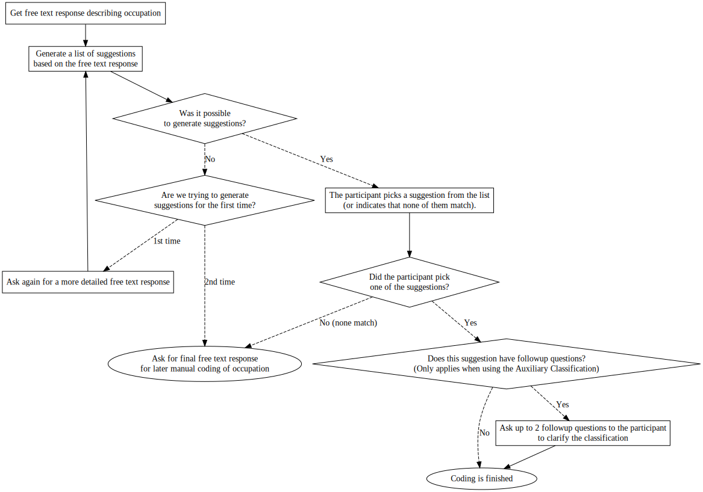

```{r, include = FALSE}
knitr::opts_chunk$set(
  collapse = TRUE,
  eval = FALSE,
  comment = "#>"
)
```

The package comes with an interactive application to quickly and easily collect your own occupation data and possibly conduct your own survey.

This application can be started by just calling the function `app()`.

```{r eval=FALSE}
library(occupationMeasurement)

# Start the interactive application with default settings
app()
```

# Flow

The flow of the app and its questions can be quite complicated. We therefore created the flow diagram below to illustrate how a participant will be guided through the app, depending on their responses.


```{r app_flow, eval=FALSE, include=FALSE}
# Since Graphviz is rendering the diagram via JS, it actually includes the
# whole JS library in the resulting document. It is therefore much more efficient to just
# render the document once and then copy-paste the resulting svg as a figure.
# This code is still included in-case the diagram needs to be updated.
DiagrammeR::grViz('
digraph G {
  free_text_1 [
    label = "Get free text response describing occupation";
    shape = rect;
  ];
  free_text_1 -> generate_suggestions;
  generate_suggestions [
    label = "Generate a list of suggestions\nbased on the free text response";
    shape = rect;
  ];

  free_text_2 [
    label = "Ask again for a more detailed free text response";
    shape = rect;
  ];
  generate_suggestions -> check_generate_suggestions;
  check_generate_suggestions [
    label = "Was it possible\nto generate suggestions?";
    shape = diamond;
  ];
  check_suggestions [
    label = "Are we trying to generate\nsuggestions for the first time?";
    shape = diamond;
  ];
  check_suggestions -> free_text_2 [ label = "1st time"; style="dashed" ];
  free_text_2 -> generate_suggestions;
  
  check_generate_suggestions -> pick_suggestion [ label = "Yes"; style="dashed" ];
  check_generate_suggestions -> check_suggestions [ label = "No"; style="dashed" ];
  pick_suggestion [
    label = "The participant picks a suggestion from the list\n(or indicates that none of them match).";
    shape = rect;
  ];
  pick_suggestion -> check_pick_suggestions;
  check_pick_suggestions [
    label = "Did the participant pick\none of the suggestions?";
    shape = diamond;
  ];
  
  check_pick_suggestions -> free_text_manual [ label = "No (none match)"; style="dashed" ];
  check_suggestions -> free_text_manual [ label = "2nd time"; style="dashed" ];
  free_text_manual [
    label = "Ask for final free text response\nfor later manual coding of occupation";
    shape = oval;
  ];

  check_pick_suggestions -> check_followup_questions [ label = "Yes"; style="dashed" ];
  check_followup_questions [
    label = "Does this suggestion have followup questions?\n(Only applies when using the Auxiliary Classification)";
    shape = diamond;
  ];
  check_followup_questions -> coding_finished [ label = "No"; style="dashed" ];
  check_followup_questions -> next_followup_question [ label = "Yes"; style="dashed" ];

  next_followup_question [
    label = "Ask up to 2 followup questions to the participant\nto clarify the classification";
    shape = rect;
  ];
  next_followup_question -> coding_finished;
  coding_finished [
    label = "✅ Coding is finished";
    shape = oval;
  ];
}
')
```

{width="100%"}

# Configuration

There are multiple ways of changing the behaviour and contents of the app. These are split into two main sections: You can change the information / contents of the app and what is shown, by using a different `questionnaire` or you can adjust general settings of the app, such as data saving options by modifying the `app_settings`.

## Different Questionnaires

The toolbox comes with different ready-made questionnaires, such as the

- default `questionnaire_web_survey()` for self-administered online surveys,
- `questionnaire_interviewer_administered()` for interviews conducted by an interviewer, or
- `questionnaire_demo()` for a version of the app that includes explanations for how the app works behind the scenes.

If you need more flexibility, you can also modify existing questionnaires or create your own ones from scratch. To do this refer to the more detailed explanations available in `vignette("app-questionnaire")`.

## Settings

There are multiple settings available to the app to change how it behaves, where data is saved and much more. These settings need to be passed to the app under the parameter `app_settings` and are created using `create_app_settings()`. You can read about all options in the function's helpfile `?create_app_settings()`. If you're specifically looking to save data into a database, you can find a detailed explanation in `vignette("app-database")`.

```{r eval=FALSE}
library(occupationMeasurement)

app(
  # Use the questionnaire for interviewer-administered interviews
  questionnaire = questionnaire_interviewer_administered(),
  app_settings = create_app_settings(
    # ... specify your custom settings here:

    # Collect an interview_id, so that you can merge data from your questionnaire
    # and from the app after data collection
    require_id = TRUE,

    # Skip follow-up questions related to ISCO skill level
    # or ISCO supervisory/managment occupations
    # (in case similar questions are already included in your questionnaire)
    skip_followup_types = c("anforderungsniveau", "aufsicht"),

    # Find optimal balance: Should occupational descriptions be suggested
    # for as many respondents as possible, even if
    # the suggested occupational descriptions are likely to be incorrect?
    get_job_suggestion_params = list(
      score_thresholds = list(simbased_wordwise = 0.535, simbased_substring = 0.2)
    )

    # ...
  )
)
```

Some settings can also be varied between individual sessions / interviews, e.g., if they were to depend on a previous question or input from an external questionnaire. To modify these "session"-settings you pass them as query parameters:

```{r eval=FALSE}
# Ask questions in past tense
https://{url-to-my-interactive-app}/?tense=past

# Use full range of supported session parameters
https://{url-to-my-interactive-app}/?respondent_id=<my_unique_interview_id>&tense=past&extra_instructions=off&num_suggestions=10
``` 

TODO: Describe all query parameters here.

These settings are also described in the help page `?create_app_settings`, as their defaults are set in the `app_settings`.

## Identifying Users

If you want to match your data with an external source or embed the interactive app within another survey, you will probably want to pass a unique interview or user identifier, a `id`, also called `respondent_id`.

This can be done adding a query parameter named `id` to the URL, i.e., `https://{url-to-my-interactive-app}/?respondent_id=my_unique_interview_id` (with {url-to-my-interactive-app} corresponding to the URL your application is running at and my_unique_interview_id corresponding to the unique id).

If you want to make sure that a `id` is always supplied, you can enforce this by setting `require_id = TRUE` in the `app_settings`.

# Data

The app will keep track of data for you and will, by default, automatically save data in multiple CSV files. These are saved to the `response_output_dir` (if `save_to_file` is `TRUE`), which can be configured in the `app_settings` (see the section above for more information). To quickly read the most important data from CSV files, the convenience function `get_responses()` is available.

Currently there are 5-6 different formats of `data` that are being saved, see below. These are differentiated by different `table_name`s. You can see these `table_name`s in the filenames of the data files, although the filenames typically also have some extra information besides the `table_name` to differentiate between files from different sessions/interviews.

If you plan to save data into a database, you can find a detailed explanation of how to do this in `vignette("app-database")`.

## Tables

The five different kinds of data i.e. "tables" that are being saved right now are outlined below.

### answers

The user's answers themselves, with one row per question/item. These are saved, whenever a page gets submitted and therefore multiple times per participant. The unique key is made from variables `session_id`, `page_id`, `start` and `item_id`.

#### Columns

- **respondent_id**: An external respondent_id to match data with another source of information. Only present if it is passed via the URL.
- **session_id**: A unique session id, identifying this exact session / completion of the survey. (Format: `respondent_id_Time stamp_Random digit)
- **page_id**: An id / name, identifying the page this answer is coming from. Multiple answers per page are possible.
- **start**: The timestamp when the user was shown this page.
- **end**: The timestamp when the user submitted the page. Response time is the difference between **start** and **end**.
- **item_id**: An id / name, identifying the item that is being answered, as there can sometimes be multiple items in a single question and multiple questions on a single page. 
- **question_text**: The text that was shown to and responded to by the participant.
- **response_id**: The id of the chosen response option by the respondent, typcially used for questions with distinct answering options. This can also be the case if a user ticks e.g. a "I don't want to respond" option.
- **response_text**: Either the raw text from a free text response or the corresponding label for distinct answering options. When the question is not a free text question, it is recommended to use response ids over texts if possible.

### results_overview

A combined version of the user's answers and information about the user themselves. These are saved at the end of the questionnaire and therefore only once per participation. `session_id` is the unique key here. Note that `respondent_id` is not necessarily unique (although it should be) because the same `respondent_id` can be passed multiple times via the URL.

#### Columns

- **session_id**: A unique session id, identifying this exaxct session / completion of the survey. (Format: `respondent_id_Time stamp_Random digit)
- **url_search**: The [search / query part](https://en.wikipedia.org/wiki/Query_string) of the URL.
- **isco_08**: The [International Standard Classification of Occupations 2008](https://www.ilo.org/wcmsp5/groups/public/@dgreports/@dcomm/@publ/documents/publication/wcms_172572.pdf) (ISCO-08) code for this respondent.
- **kldb_10**: The [German Klassifikation der Berufe 2010 - erste Fassung](https://statistik.arbeitsagentur.de/DE/Navigation/Grundlagen/Klassifikationen/Klassifikation-der-Berufe/Archiv-KldB/KldB2010/KldB2010-Nav.html) (KldB-2010) code for this respondent.
- **respondent_id**: An external respondent_id to match data with another source of information. Only present if it is passed via the URL.
- **P_{page_id}_Q_{item_id}_R_{id/text}**: *Two* columns for every question/item answered by the respondent. These columns correspond to the naming convention ***P_{page_id}_Q_{item_id}_R_id*** for response ids and ***P_{page_id}_Q_{item_id}_R_text*** for response texts (see the documentation for answers for additional information).

### occupations_suggested

The list of suggestions shown to the user. These are saved at the moment when suggestions are generated and therefore *typically* once per participation, but not necessarily. The unique key is made from variables `session_id`, `start`, `id`, and `auxco_id`.

This list also includes "other" response options, such as "No response" or "Other".

At the moment these are only saved when the `suggestion_type` is `auxco-1.2.x`.

#### Columns

- **auxco_id**: The unique identifier of the suggestion, matching the suggestion_type.
- **input_text**: The free text response that was used to generate the suggestions.
- **score**: The assigned score to the suggestion. These scores roughly correspond to the probability of being picked.
- **title**: The occupation title of the suggestion.
- **task**: The task of the suggestion. This is the main field 
- **task_description**: A more detailed description of the task associated with the suggestion.
- **kldb_title_short**: A shortend version of the suggestion's title.
- **has_followup_questions**: Whether this suggestion has any followup questions.
- **id**: The `response_id` corresponding with this option. Use to also identify "other" response options than suggested occupations.
- **session_id**: A unique session id, identifying this exaxct session / completion of the survey. 
- **start**: The timestamp when the user was shown the page with these suggestions.

### toggle_submitted

Information on when and which suggestions were clicked to be expanded (or closed) by a participant. The unique key is made from variables `session_id` and `time`.

#### Columns

- **respondent_id**: An external respondent_id to match data with another source of information. Only present if it is passed via the URL.
- **session_id**: A unique session id, identifying this exaxct session / completion of the survey.
- **toggle_message**: A brief identifier, showing whether an option was opened or closed and which option it was.
- **time**: A timestamp identifying when it was opened / closed.

### session_info

Information on all sessions, saved whenever a session is ended (after a timeout, upon leaving the app or when stopping the server). The unique key is `session_id`.

This is mainly useful for understanding whether some users may start multiple sessions in the app.

#### Columns

- **respondent_id**: An external respondent_id to match data with another source of information. Only present if it is passed via the URL.
- **session_id**: A unique session id, identifying this exaxct session / completion of the survey.
- **url_search**: The [search / query part](https://en.wikipedia.org/wiki/Query_string) of the URL.
- **history**: String with each questionnaire page visited. For example, `1-` indicates that the session was ended on or before the first page was shown. `1-3-7` indicates that three pages were shown and the session ended on page 7. When the `previous` button is pressed, this page is not saved here.
- **time_session_ended**: Timestamp when this `session_info`-record got saved.

# Deployment

If you want to deploy the interactive app to an actual server for use in a production environment you can find detailed instructions in `vignette("app-deployment")`.
